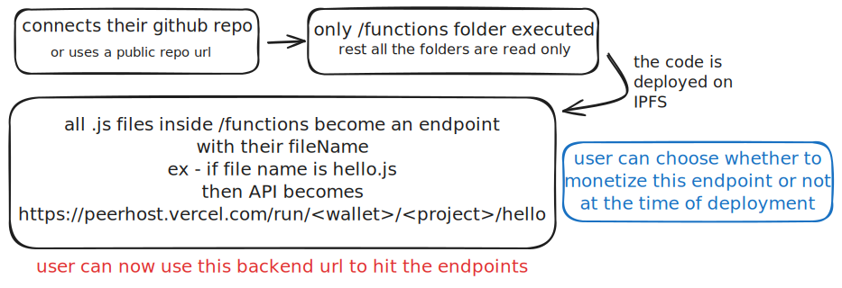
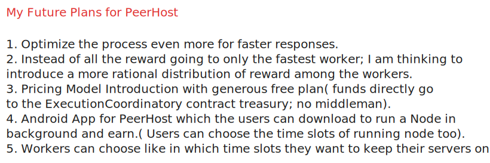
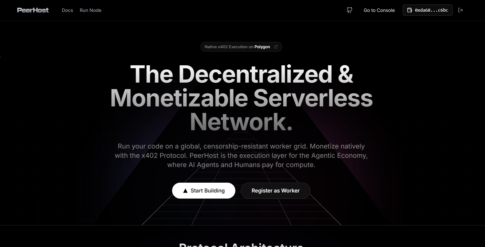
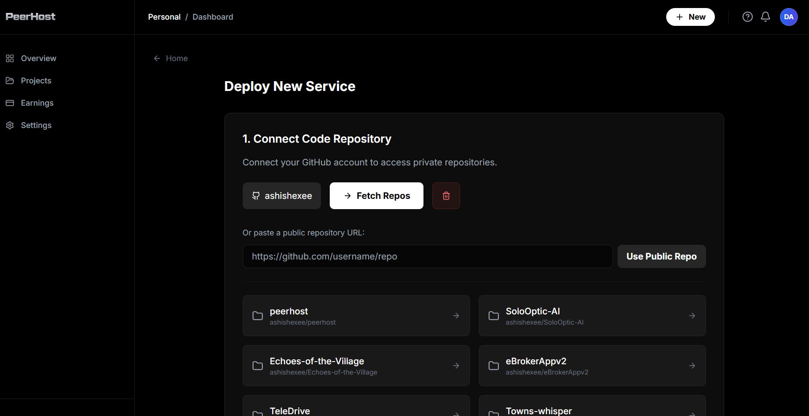
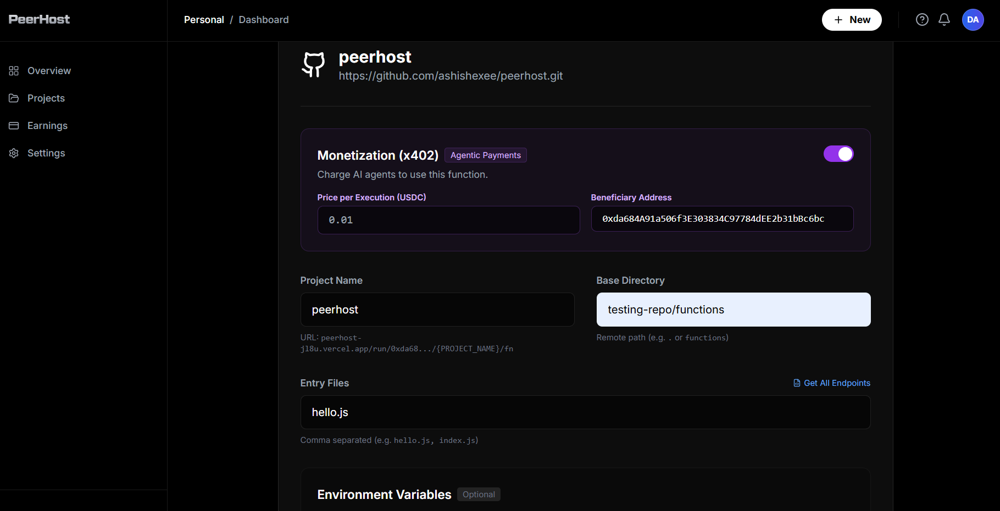
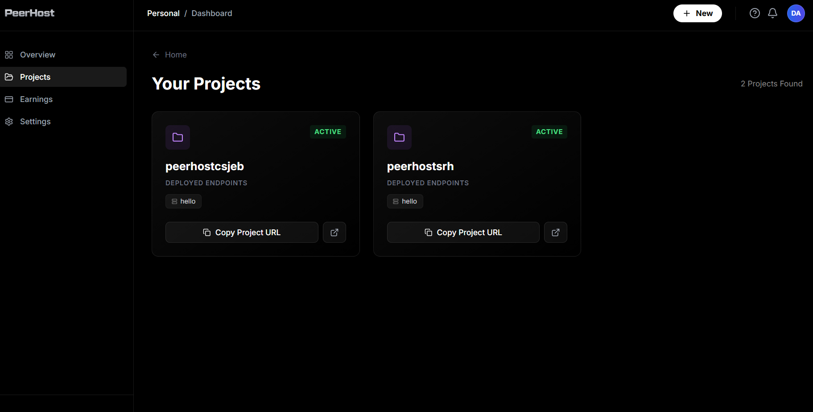
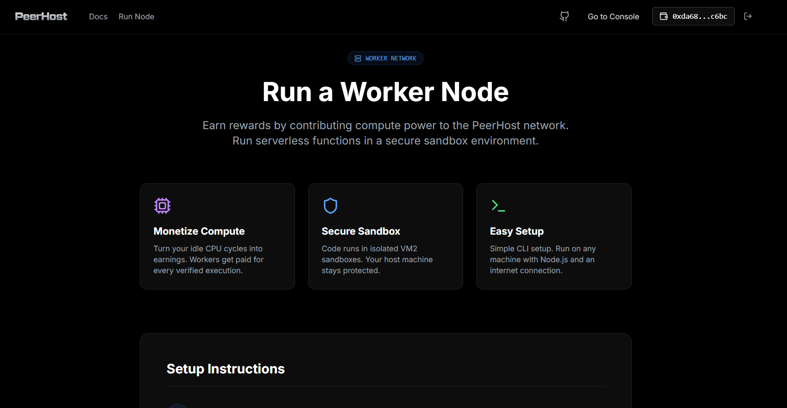
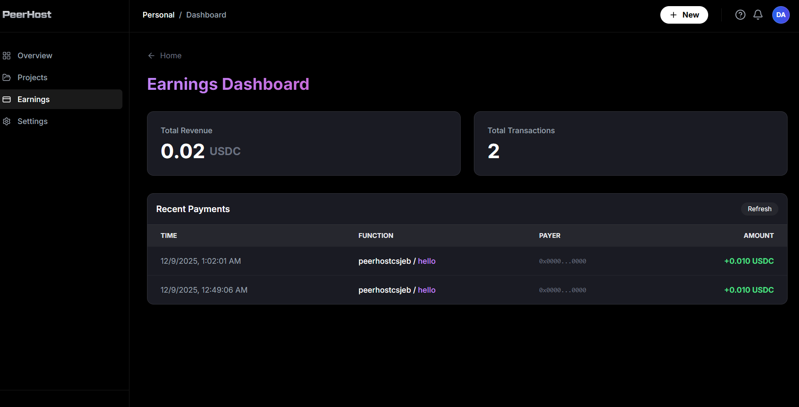
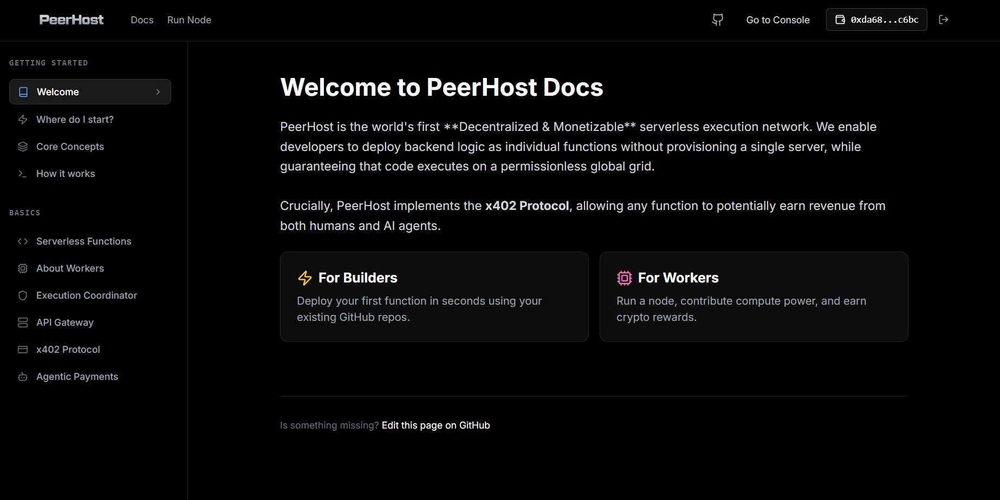
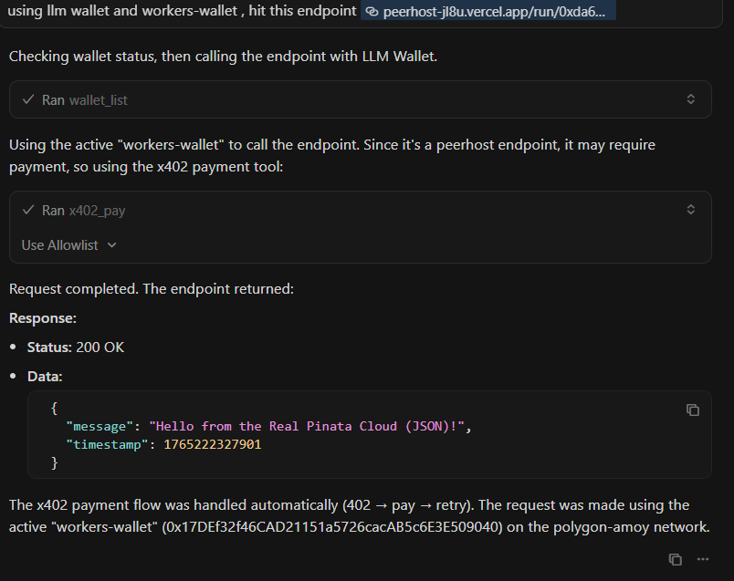

# PeerHost — The Universal Decentralized & Monetizable Serverless Network

**PeerHost** is a next-generation serverless platform that evolves the cloud in two revolutionary ways:

1.  **Unstoppable Execution**: A distributed, censorship-resistant worker network coordinated on **Polygon**.
2.  **Native Monetization**: The first platform where developers can **price their API endpoints** using the **x402 Protocol**.

While PeerHost is the **native execution layer for the Agentic Economy**, its open monetization standard is **universally compatible**. Whether accessed by an AI Agent, a dApp, or a human developer, **PeerHost gets you paid**.

**Build Unstoppable Backends. Monetize Every Request.**

> **Protocol Economics & Sustainability**
>
> Currently, PeerHost is **subsidized**—users can deploy and execute serverless functions for free, with the `ExecutionCoordinator` treasury (already funded) covering worker fees. Also the payment from the paid endpoints gets directly into the `Owners` wallet.
>
> **Future Roadmap**: We will transition to a fully self-sustaining system:
> *   **Free Tier**: Users will continue to enjoy a free execution quota.
> *   **Treasury Funding**: To exceed free limits, users will deposit funds directly into the `ExecutionCoordinator.sol` treasury.
> *   **No Middlemen**: Smart contracts handle all coordination. You fund the treasury, and the treasury pays the workers directly.

---
<p align="center">
  
  <br><b>User Flow</b>
</p>
<br>
<p align="center">
  
  <br><b>Architecture</b>
</p>
<br>
<p align="center">
  
  <br><b>Future Plans</b>
</p>

## Core Principles
### 1. Universal Monetization (Agents + Humans)

PeerHost treats every function call as a potential transaction.

*   **x402 Protocol**: Built-in specialized header support for HTTP 402 Payment Required.
*   **Agent-Optimized**: AI Agents can autonomously negotiate, pay for, and consume APIs using the Model Context Protocol (MCP).
*   **Human-Compatible**: Works seamlessly with standard dApps and wallets.

---

### 2. Decentralized Execution Grid

Code does not run on a single server. It runs on a global grid of independent workers.

*   **No Single Point of Failure**: Request routing is dynamic and redundant.
*   **Censorship Resistance**: Code cannot be taken down by a single entity.
*   **Auto-Healing**: If one node goes offline, another node takes its place automatically.

---

### 3. Security by Isolation

Every function execution happens inside an **ephemeral, isolated sandbox**:

* Docker or microVM based isolation
* Strict CPU and memory limits
* Network access only when explicitly allowed
* Filesystem isolation by default

Workers cannot persist state between executions and never receive long-lived secrets.

---

### 4. Immutable Code Execution

All function code is bundled and stored on **IPFS**:

* Content-addressed
* Immutable
* Globally retrievable
* Verifiable by all workers

This guarantees that the code executed at runtime is **exactly the code the developer deployed**, without modification.

---

### 5. Trustless On-Chain Coordination

Execution is coordinated through the **Execution Coordinator smart contract** on **Polygon Amoy Testnet**:

* **Service Registration**: Functions and their prices are registered on-chain.
* **Payment Settlement**: Uses **x402** to gate execution until payment is verified.
* **Result Verification**: Dispute resolution and slashing happens on Polygon.

---

### 6. Verifiable Proof-of-Execution

Workers compete to execute requests and must submit **cryptographic proofs of result correctness**. Honest execution is rewarded, and malicious behavior can be penalized via staking and slashing mechanisms.

This creates a **self-incentivizing compute network**.

---
## Platform Tour

<table width="100%">
  <tr>
    <td width="33%" align="center">
      
      <br><b>Landing Page</b>
    </td>
    <td width="33%" align="center">
      
      <br><b>Deployment</b>
    </td>
    <td width="33%" align="center">
      
      <br><b>Configuration</b>
    </td>
  </tr>
  <tr>
    <td width="33%" align="center">
      
      <br><b>All Projects</b>
    </td>
    <td width="33%" align="center">
      
      <br><b>Worker Node</b>
    </td>
    <td width="33%" align="center">
      
      <br><b>Earnings</b>
    </td>
  </tr>
</table>

<table width="100%">
  <tr>
    <td width="50%" align="center">
      
      <br><b>Documentation</b>
    </td>
    <td width="50%" align="center">
      
      <br><b>Agentic AI Integration</b>
    </td>
  </tr>
</table>

---

## High-Level Architecture

PeerHost operates as a five-layer system:

1. **Application Layer**
   Clients interact using ordinary HTTP/REST requests.

2. **Gateway Layer**
   Authenticates, validates, canonicalizes requests and triggers on-chain execution.

3. **Blockchain Coordination Layer (Polygon Amoy)**
    Smart contracts coordinate job dispatch, result submission, and incentive settlement.

4. **Worker Network**
   Distributed worker nodes execute functions inside secure sandboxes.

5. **Storage Layer (IPFS)**
   Immutable storage for bundled function code and static assets.

End-users experience a normal low-latency API. Under the hood, execution is fully decentralized.

---

## Developer Experience

PeerHost is designed to feel as simple as modern serverless platforms.

### Deployment Flow

```text
1. Connect GitHub repository (or public repo URL)
2. Add environment variables
3. Deploy
```

Behind the scenes, PeerHost:

* Extracts your `/functions` directory
* Bundles each function using deterministic builds
* Uploads bundles to IPFS
* Registers execution metadata
* Makes the functions live instantly

### Live Endpoints

Your functions become immediately accessible at:

```
https://<wallet>.peerhost.com/<project>/<function>
```

No servers to provision.
No scaling rules to configure.
No cold starts.

---

## Primary Use Cases

* **API Backends** — Fast, globally available REST APIs
* **Event & Webhook Processing** — Stripe, Twilio, GitHub, etc.
* **dApp Backends** — Off-chain compute for Web3 frontends
* **Agent Skills** — Monetized tools and services for AI Agents (e.g. "Search Web", "Analyze Data")
* **Automation & Job Runners** — Deterministic background execution
* **Micro-services at Internet Scale** — Without infrastructure overhead

---

## Worker Network & Incentives

PeerHost is a two-sided network:

### Builders

Deploy backend logic without running any servers.

### Workers

Contribute compute power to the network and earn rewards by:

* Running a PeerHost worker node
* Listening for on-chain execution events
* Executing functions in secure sandboxes
* Submitting verifiable results on-chain

Workers stake collateral to participate and are rewarded for correct execution, establishing economic security for the network.

---

## What PeerHost Is (and Is Not)

**PeerHost is:**

* A serverless backend runtime
* A blockchain-coordinated compute network
* A developer infrastructure protocol
* An **Agentic Payment Gateway**

**PeerHost is not:**

* A traditional cloud hosting provider
* A centralized serverless platform
* A DeFi product
* A storage-only protocol

---

## Network Status

* Execution: ✅ On-chain coordinated
* Storage: ✅ IPFS-backed
* Workers: ✅ Distributed sandboxed runtime
* Gateway: ✅ HTTP + WebSocket orchestration

---

## Join PeerHost

You can participate as both a user and a contributor:

* **Start Building** — Deploy your first decentralized backend
* **Run a Worker** — Contribute to the execution layer and earn rewards
* **Contribute to the Protocol** — Open-source, community-driven development

---

## Final Statement

**PeerHost is the missing infrastructure layer between Web2 backends and Web3 trust guarantees.**
It brings serverless execution into the decentralized era — without sacrificing developer experience, performance, or security.

> *PeerHost — The Backend for the Unstoppable Web.*