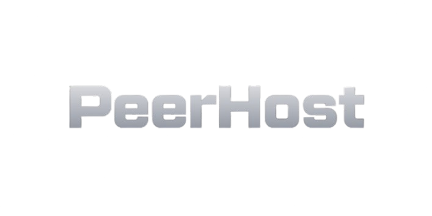

# PeerHost — The Decentralized Serverless Execution Network

**PeerHost** is a decentralized, trust-minimized, serverless backend execution network that allows developers to deploy **functions instead of servers**. Execution is coordinated on-chain and distributed across a global network of sandboxed worker nodes, delivering infrastructure that is **resilient, censorship-resistant, and horizontally scalable by design**.

PeerHost removes the dependency on centralized cloud providers while preserving the simplicity of modern serverless developer experience.

---

## Why PeerHost Exists

Modern backend infrastructure is fast, but fundamentally centralized. Even “serverless” platforms ultimately depend on a small number of cloud providers, creating risks around:

* Vendor lock-in
* Regional outages
* Silent censorship
* Opaque execution guarantees
* Rising operational costs at scale

PeerHost redesigns backend infrastructure around **decentralized coordination and distributed execution**.

---

## Core Principles

### 1. Decentralized by Architecture

PeerHost is not hosted on any single cloud provider. Function execution is performed by a **globally distributed, permissionless worker network**. No single entity controls where or how your backend executes.

If one node goes offline, another node takes its place automatically.

---

### 2. Security by Isolation

Every function execution happens inside an **ephemeral, isolated sandbox**:

* Docker or microVM based isolation
* Strict CPU and memory limits
* Network access only when explicitly allowed
* Filesystem isolation by default

Workers cannot persist state between executions and never receive long-lived secrets.

---

### 3. Immutable Code Execution

All function code is bundled and stored on **IPFS**:

* Content-addressed
* Immutable
* Globally retrievable
* Verifiable by all workers

This guarantees that the code executed at runtime is **exactly the code the developer deployed**, without modification.

---

### 4. Trustless On-Chain Coordination

Execution is coordinated through the **Execution Coordinator smart contract** on Polygon:

* Requests are created on-chain
* Execution jobs are broadcast via blockchain events
* Results are submitted on-chain
* Disputes can be verified cryptographically

No trusted central scheduler is required.

---

### 5. Verifiable Proof-of-Execution

Workers compete to execute requests and must submit **cryptographic proofs of result correctness**. Honest execution is rewarded, and malicious behavior can be penalized via staking and slashing mechanisms.

This creates a **self-incentivizing compute network**.

---

## High-Level Architecture

PeerHost operates as a five-layer system:

1. **Application Layer**
   Clients interact using ordinary HTTP/REST requests.

2. **Gateway Layer**
   Authenticates, validates, canonicalizes requests and triggers on-chain execution.

3. **Blockchain Coordination Layer (Polygon)**
   Smart contracts coordinate job dispatch, result submission, and incentive settlement.

4. **Worker Network**
   Distributed worker nodes execute functions inside secure sandboxes.

5. **Storage Layer (IPFS)**
   Immutable storage for bundled function code and static assets.

End-users experience a normal low-latency API. Under the hood, execution is fully decentralized.

---

## Developer Experience

PeerHost is designed to feel as simple as modern serverless platforms.

### Deployment Flow

```text
1. Connect GitHub repository (or public repo URL)
2. Add environment variables
3. Deploy
```

Behind the scenes, PeerHost:

* Extracts your `/functions` directory
* Bundles each function using deterministic builds
* Uploads bundles to IPFS
* Registers execution metadata
* Makes the functions live instantly

### Live Endpoints

Your functions become immediately accessible at:

```
https://<wallet>.peerhost.com/<project>/<function>
```

No servers to provision.
No scaling rules to configure.
No cold starts.

---

## Primary Use Cases

* **API Backends** — Fast, globally available REST APIs
* **Event & Webhook Processing** — Stripe, Twilio, GitHub, etc.
* **dApp Backends** — Off-chain compute for Web3 frontends
* **Automation & Job Runners** — Deterministic background execution
* **Micro-services at Internet Scale** — Without infrastructure overhead

---

## Worker Network & Incentives

PeerHost is a two-sided network:

### Builders

Deploy backend logic without running any servers.

### Workers

Contribute compute power to the network and earn rewards by:

* Running a PeerHost worker node
* Listening for on-chain execution events
* Executing functions in secure sandboxes
* Submitting verifiable results on-chain

Workers stake collateral to participate and are rewarded for correct execution, establishing economic security for the network.

---

## What PeerHost Is (and Is Not)

**PeerHost is:**

* A decentralized execution fabric
* A serverless backend runtime
* A blockchain-coordinated compute network
* A developer infrastructure protocol

**PeerHost is not:**

* A traditional cloud hosting provider
* A centralized serverless platform
* A DeFi product
* A storage-only protocol

---

## Network Status

* Execution: ✅ On-chain coordinated
* Storage: ✅ IPFS-backed
* Workers: ✅ Distributed sandboxed runtime
* Gateway: ✅ HTTP + WebSocket orchestration

---

## Join PeerHost

You can participate as both a user and a contributor:

* **Start Building** — Deploy your first decentralized backend
* **Run a Worker** — Contribute to the execution layer and earn rewards
* **Contribute to the Protocol** — Open-source, community-driven development

---

## Final Statement

**PeerHost is the missing infrastructure layer between Web2 backends and Web3 trust guarantees.**
It brings serverless execution into the decentralized era — without sacrificing developer experience, performance, or security.

> *PeerHost — The Backend for the Unstoppable Web.*